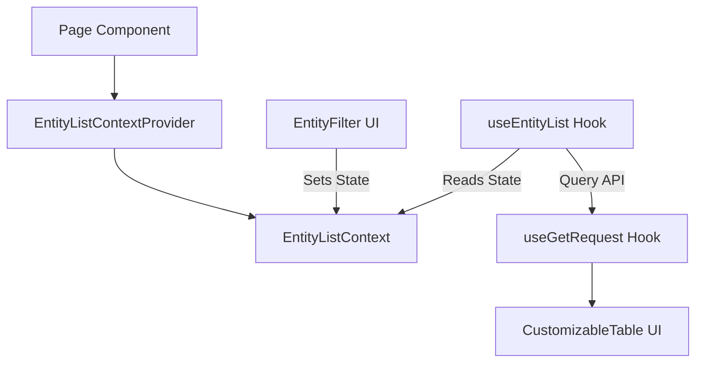

# Coffer Architecture & Design Conventions

This repository outlines the design patterns, code standards, and folder structures implemented in **Coffer**. This architecture is framework-agnostic (excluding standard React primitives) and is designed to be easily ported to other React-based applications (such as Next.js, Vite, or React Native/Expo with corresponding UI adaptations).

---

## 1. Directory Blueprint

When porting this architecture, the standard layout under `src/` (or the root source directory) should follow:

```
src/
├── components/          # React Presentation Layer
│   ├── ui/              # Low-level UI primitives (Inputs, Buttons, Cards, Modals)
│   ├── shared/          # Reusable application components (InputField, OTPInputField)
│   └── [feature]/       # Feature-specific modules (e.g. users/, kyc/)
├── constants/           # Global immutable configs and constants
├── hooks/               # Core data-fetching hooks and browser state managers
├── icons/               # Centralized SVG registry (SvgIcon.tsx)
├── services/            # Reusable utility scripts and global API instances
├── types/               # Globally shared TypeScript definitions
└── validations/         # Form validation schemas
```

---

## 2. Naming Conventions

To ensure codebase predictability and consistency across teams, the following naming patterns must be enforced:

### 2.1 File & Folder Case Rules
*   **Directories**: Kebab-case (e.g., `components/shared`, `ui/`, `kyc/`).
*   **Components & Context Providers**: PascalCase (e.g., `InputField.tsx`, `UserListContextProvider.tsx`).
*   **Hooks**: camelCase prefixed with `use` (e.g., `useGetRequest.tsx`, `useUserList.ts`).
*   **Services & Validations**: PascalCase (e.g., `ValidationServices.ts`, `AuthValidations.ts`).
*   **Helpers, Types & Constant Files**: camelCase (e.g., `api.ts`, `genericTypes.ts`).

### 2.2 Payload & API Conventions
*   **API Fields**: Always use `snake_case` for request payloads, response objects, and DTOs (e.g., `refresh_token`, `date_of_birth`, `kyc_status[]`).
*   **React State & Props**: Use standard `camelCase` for props and internal state variables, converting to `snake_case` when compiling outgoing payloads.
*   **Parameter Passing**: Always pass named properties (objects) between custom functions rather than positional arguments. E.g.:
    ```typescript
    // CORRECT
    function createUser({ queryDto, user }: { queryDto: QueryDto; user: UserMetaData }) { ... }

    // INCORRECT
    function createUser(queryDto: QueryDto, user: UserMetaData) { ... }
    ```

---

## 3. Core Architectural Modules

### 3.1 Network Layer: Query & Mutation Wrappers
To decouple pages and components from direct Axios or fetch calls, all HTTP requests must flow through custom TanStack Query wrappers:

1.  **GET Requests**: Wrapped in [useGetRequests.tsx](file:///Users/mac/Documents/utilor/coffer-admin/src/hooks/useGetRequests.tsx). It combines query keys with runtime filters (`params`) to automatically manage cache invalidation and handles focus refocusing.
2.  **POST/PUT/DELETE Mutations**: Wrapped in [usePostRequests.tsx](file:///Users/mac/Documents/utilor/coffer-admin/src/hooks/usePostRequests.tsx). It processes mutations, captures status errors (like 403 or 422), and automatically triggers success/error notifications using `sonner`.
3.  **API Instance**: Configured in [api.ts](file:///Users/mac/Documents/utilor/coffer-admin/src/services/api.ts). Uses request interceptors to pull access tokens from Cookies and dynamically inject authorization headers.

### 3.2 Form State & Validation Layer
Form validation utilizes **React Hook Form** combined with **Yup** schemas:

*   **Constraint Consolidation**: Individual field validations are abstracted into helper methods inside [ValidationServices.ts](file:///Users/mac/Documents/utilor/coffer-admin/src/services/ValidationServices.ts). This ensures that rules (such as passwords requiring 1 uppercase letter and 1 digit) are declared once and reused globally.
*   **Strict Typing**: Every schema is bound to a TypeScript interface/type defining the shape of form data (e.g., `UserLoginFormData` in [AuthValidations.ts](file:///Users/mac/Documents/utilor/coffer-admin/src/validations/AuthValidations.ts)).
*   **Reusable Input Fields**: Custom wrapper components (like [InputField.tsx](file:///Users/mac/Documents/utilor/coffer-admin/src/components/shared/InputField.tsx)) receive the form's `register` and `fieldName` hook output, rendering the input, floating label, and errors inline.

### 3.3 Centralized SVG Icons
Rather than scattering SVG graphics across standard components, Coffer consolidates graphics inside [SvgIcon.tsx](file:///Users/mac/Documents/utilor/coffer-admin/src/icons/SvgIcon.tsx).

*   Icons are defined as simple functional components accepting `LucideProps`.
*   All styles (dimensions, animations, colors) are controlled dynamically from the calling scope via CSS classes or props, utilizing `currentColor` values for inline fills.

### 3.4 The "List Context" Design Pattern
For views managing complex tabular data, filters, search terms, and pagination, do not store state directly in the root page component. Use a dedicated context:



1.  **ContextProvider**: Declares states for search inputs, page indices, and filter arrays (e.g., [UserListContextProvider.tsx](file:///Users/mac/Documents/utilor/coffer-admin/src/components/users/UserListContextProvider.tsx)).
2.  **Context Consumer Hook**: Consumed inside list controls or page content blocks (e.g., [useUserListContext.ts](file:///Users/mac/Documents/utilor/coffer-admin/src/components/users/useUserListContext.ts)).
3.  **Data Fetcher Hook**: Reads filter values directly from Context and executes the API requests (e.g., [useUserList.ts](file:///Users/mac/Documents/utilor/coffer-admin/src/hooks/useUserList.ts)).
4.  **Display Component**: Wraps elements inside customizable UI interfaces (like `CustomizableTable`) with responsive fallbacks (`MobileCards`) for smaller displays.

### 3.5 Token Management & Refresh Lifecycle
Session state is secured using HTTP cookie storage:

*   **Cookie Services**: [CookiesServices.ts](file:///Users/mac/Documents/utilor/coffer-admin/src/services/CookiesServices.ts) reads/writes split tokens (access vs. refresh credentials) and schedules cookie expirations.
*   **Token Refresh Hook**: [useTokenRefresh.tsx](file:///Users/mac/Documents/utilor/coffer-admin/src/hooks/useTokenRefresh.tsx) runs in the background. It reads the expiry status and triggers an immediate token refresh mutation if the access token has expired or is nearing its threshold, logging the user out only after persistent error failures.

---

## 4. Porting This Architecture

To port this pattern to a new application:

1.  **Install Core Libraries**:
    Ensure the target project has the following base dependencies installed:
    ```bash
    npm install @tanstack/react-query axios yup react-hook-form @hookform/resolvers sonner lucide-react class-variance-authority clsx tailwind-merge
    ```
2.  **Copy Utilities**:
    Migrate the following files to serve as your basic framework:
    *   [api.ts](file:///Users/mac/Documents/utilor/coffer-admin/src/services/api.ts) & [CookiesServices.ts](file:///Users/mac/Documents/utilor/coffer-admin/src/services/CookiesServices.ts)
    *   [useGetRequests.tsx](file:///Users/mac/Documents/utilor/coffer-admin/src/hooks/useGetRequests.tsx) & [usePostRequests.tsx](file:///Users/mac/Documents/utilor/coffer-admin/src/hooks/usePostRequests.tsx)
    *   [ValidationServices.ts](file:///Users/mac/Documents/utilor/coffer-admin/src/services/ValidationServices.ts)
    *   [InputField.tsx](file:///Users/mac/Documents/utilor/coffer-admin/src/components/shared/InputField.tsx)
3.  **Establish Environment Variables**:
    Define variables corresponding to your API bases (e.g., `VITE_API_BASE_URL` or `NEXT_PUBLIC_API_BASE_URL`).
4.  **Configure Theme & Globals**:
    Ensure tailwind classes or vanilla CSS mappings match the styling expectations used in your low-level layout primitives.
